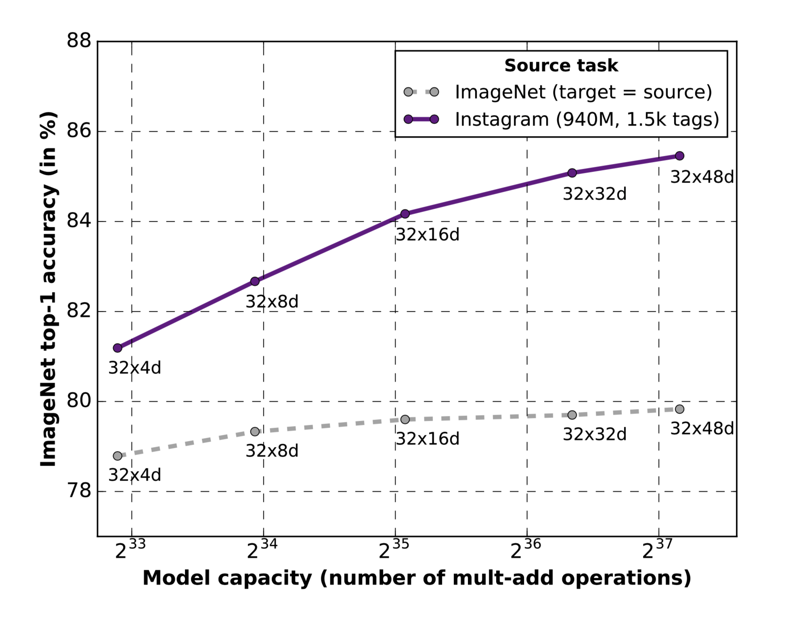

# ResNeXt-WSL-Caffe

## Introduction

<div align="center">
    
</div>

The ResNext models trained with billion scale weakly-supervised data. Please refer to [Exploring the Limits of Weakly Supervised Pretraining](https://arxiv.org/abs/1805.00932) presented at ECCV 2018 for the details of model training. The Caffe models are converted from PyTorch.

## Results on ImageNet

|Network            |Top-1 Acc.|Top-5 Acc.|Google Drive|Baidu Yun|
|:------------------|:--------:|:--------:|:----------:|:-------:|
| ResNeXt-101 32x8d | 82.2     | 96.4     | [`link`](https://drive.google.com/open?id=17yFc5bsVx4hMbbBg8PqOTu5G7GDbAU3i) | [`link`](https://pan.baidu.com/s/1Gy8fV7cs_A4EjQJs3A9kng) `didj` |
| ResNeXt-101 32x16d| 84.2     | 97.2     | [`link`](https://drive.google.com/open?id=1cSZE2RimM_IpDL7j8G9LU6ZJCoce4iXD)|[`link`](https://pan.baidu.com/s/18wY-w4RCMp-v7HA4KHffHA) `wtru` |
| ResNeXt-101 32x32d| 85.1     | 97.5     | [`link`](https://drive.google.com/open?id=1IecIYz_6vuWs37vxd4YNw8BqdobhagQ6)|[`link`](https://pan.baidu.com/s/1lJW-uikb8KX9yZZ1WSr_gw) `jc9e` |

**Note**: Testing Input Size: 224 x 224

## Evaluate Models with a Single Image

Evaluate ResNeXt-101 32x8d:

`python2 eval_img.py --proto resnext-101-32x8d-wsl.prototxt --model resnext-101-32x8d-wsl.caffemodel --image imgs/cat.jpg`

Expected Outputs:

```bash
0.82 - 'n02124075 Egyptian cat'
0.09 - 'n02123045 tabby, tabby cat'
0.04 - 'n02127052 lynx, catamount'
0.03 - 'n02123159 tiger cat'
0.00 - 'n02123394 Persian cat'
```

Evaluate ResNeXt-101 32x16d:

`python2 eval_img.py --proto resnext-101-32x16d-wsl.prototxt --model resnext-101-32x16d-wsl.caffemodel --image imgs/cat.jpg`

Expected Outputs:

```bash
0.85 - 'n02124075 Egyptian cat'
0.06 - 'n02127052 lynx, catamount'
0.04 - 'n02123159 tiger cat'
0.03 - 'n02123045 tabby, tabby cat'
0.00 - 'n02123394 Persian cat'
```

Evaluate ResNeXt-101 32x32d:

`python2 eval_img.py --proto resnext-101-32x32d-wsl.prototxt --model resnext-101-32x32d-wsl.caffemodel --image imgs/cat.jpg`

Expected Outputs:

```bash
0.91 - 'n02124075 Egyptian cat'
0.04 - 'n02123045 tabby, tabby cat'
0.02 - 'n02127052 lynx, catamount'
0.01 - 'n02123159 tiger cat'
0.00 - 'n02123394 Persian cat'
```

## How to Use Converter

`python3 converter/pt_to_caffe.py --save-root tmp --net resnext-101-32x48d`

**Requirements**:

- PyTorch >= 1.0.1
- Python >= 3.5
- torchvision >= 0.2.0

## Support & Contributing

A problem will be encountered when converting the largest model `ResNeXt-101 32x48d`. If you have enough space to make it work, welcome to contribute.

```bash
Transform Completed
[libprotobuf FATAL google/protobuf/wire_format.cc:752] CHECK failed: (output->ByteCount()) == (expected_endpoint): : Protocol message serialized to a size different from what was originally expected.  Perhaps it was modified by another thread during serialization?
terminate called after throwing an instance of 'google::protobuf::FatalException'
  what():  CHECK failed: (output->ByteCount()) == (expected_endpoint): : Protocol message serialized to a size different from what was originally expected.  Perhaps it was modified by another thread during serialization?
Aborted (core dumped)
```

## References

- https://pytorch.org/hub/facebookresearch_WSL-Images_resnext/
- https://github.com/shicai/MobileNet-Caffe/blob/master/eval_image.py
- https://github.com/xxradon/PytorchToCaffe
